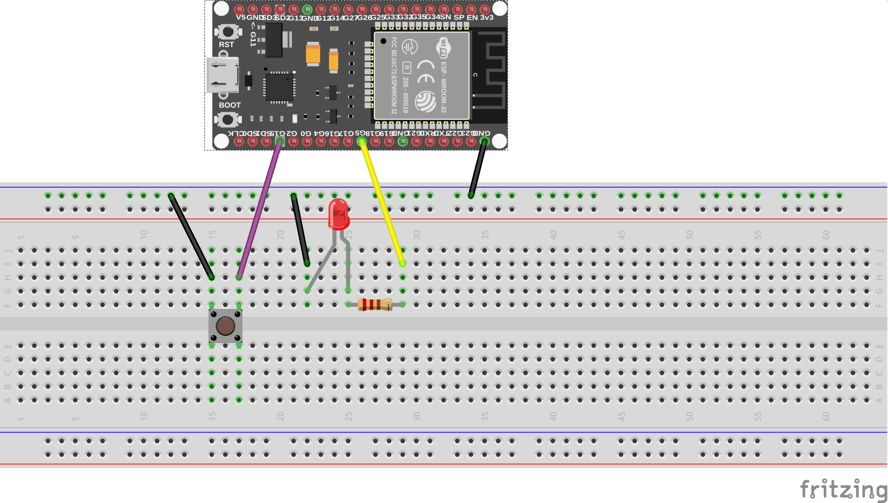

## button example
**With a push-button we illustrate the basic use of a GPIO pin as INPUT**  
Internal Pull up resistor is activated in the code. No need to add one on the breadboard

## Hookup guide:

