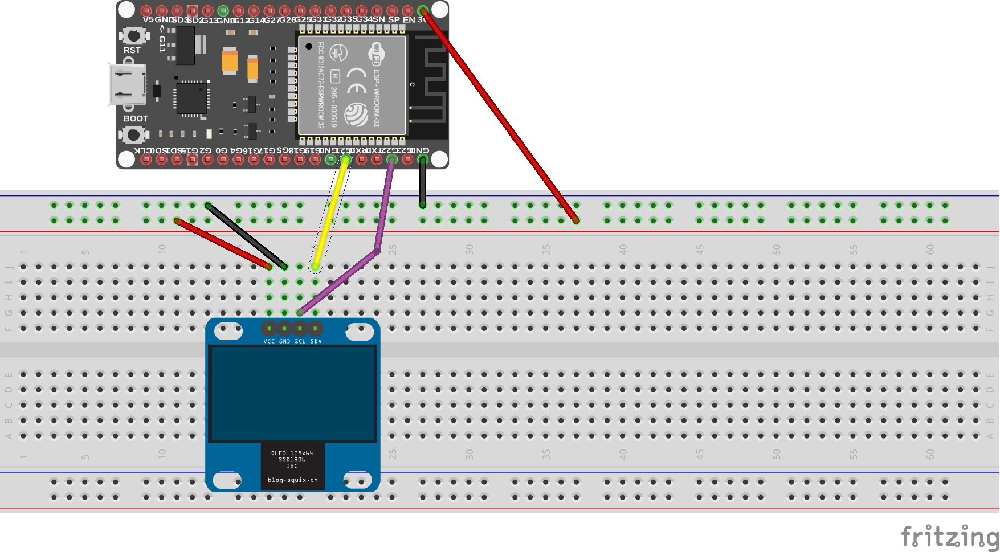

## SSD1306 OLED Display example

**Basic test for an I2C driven ssd1306 OLED display** <br />

**You must upload the _ssd1306.py_ module to the board in order to use the included code examples**<br />

### To test if we have a functional connection with the display (or any i2c device), the following lines will do the trick

```python
from machine import Pin, SoftI2C
i2c = SoftI2C(scl=Pin(22), sda=Pin(21))
i2c.scan()
```

### oledHello.py

This is a very minimal code to show simple text on the screen

### Hookup guide:



The _ssd1306.py_ module was written by Alex Newton and published at the following link: [how2electronics-ssd1306](https://how2electronics.com/interfacing-ssd1306-oled-display-with-raspberry-pi-pico/) <br />

