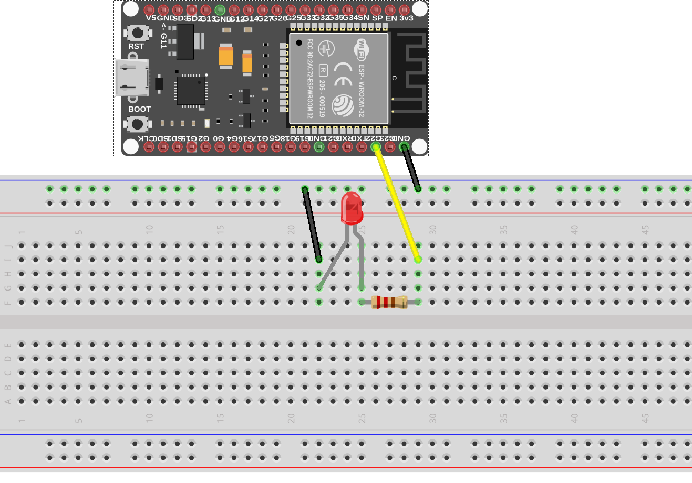

## ESP32 Blink example

Modules used in blink.py code:
- machine
- utime 

create a LED object:

```python

# change the pin number for your own setup

led = Pin(22,Pin.OUT)

```

on/off state is controlled by using the __value__ function

```python
myLed.value(1)
myLed.value(0)
```

### Hookup guide:

__ALWAYS ADD A RESISTOR FOR THE LED!__ (220 or 330 ohm for example)



